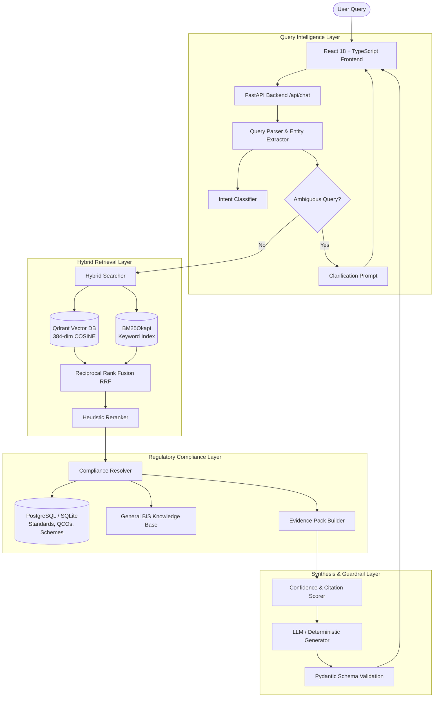

<div align="center">

# 🏛️ ManakSetu (मानकसेतु)
### AI-Powered Intelligent Assistant for Indian Standards & BIS Services
**Smart India Hackathon (SIH26107)**

[](https://fastapi.tiangolo.com)
[](https://react.dev)
[](https://tailwindcss.com)
[](https://qdrant.tech)
[](https://python.org)
[-10B981.svg?style=for-the-badge)](docs/status/TIER_EVALUATION_REPORT.md)

<p align="center">
  <b>Bridging Indian Industry and Citizens with Authoritative Standards, Quality Control Orders (QCOs), and BIS Certification Routes.</b>
</p>

[Key Features](#-key-features) • [System Architecture](#-system-architecture) • [3-Tier Benchmark](#-3-tier-evaluation-benchmark) • [Quick Start](#-quick-start--installation) • [API Reference](#-api-endpoints) • [Tech Stack](#-tech-stack)

---

</div>

## 📌 Executive Overview

**ManakSetu (मानकसेतु)** is a full-stack, enterprise-grade AI compliance platform built for **SIH26107**. It democratizes access to dense regulatory standards published by the **Bureau of Indian Standards (BIS)** and Central Government Ministries.

Whether you are a manufacturer navigating mandatory **Quality Control Orders (QCOs)** and **Scheme-I / Scheme-II (CRS)** factory testing protocols, or a consumer verifying an authentic **ISI Mark** and 7-digit **CM/L license number**, ManakSetu provides instant, verbatim-cited, zero-hallucination guidance.

---

## ✨ Key Features

### 1. 🖥️ AI-Native Dual-Pane Workspace
- **Left / Center Pane**: Real-time markdown chat stream, confidence scoring badge (`HIGH`, `MEDIUM`, `LOW`), quick query chips, interactive checklists, and clickable citation pills.
- **Right Context Inspector**: Synchronized secondary inspector containing:
  - **Standards Viewer**: Search Indian Standards, view scope, active amendments, and browse clause-by-clause hierarchies with document page numbers.
  - **Compliance & QCO Panel**: Gazette notifications, Line Ministry details (DPIIT, MoCA, MeitY, MOP), enforcement deadlines, and factory **Scheme of Testing & Inspection (STI)** roadmaps.

### 2. 👥 Persona-Adaptive Reasoning Engine
- **🛡️ Consumer Mode**: Plain-language, safety-centric advice with step-by-step instructions on verifying the ISI Mark and CM/L license number via the **BIS CARE App**.
- **⚡ Industry / Pro Mode**: Technical clause thresholds (e.g. proof pressure, leakage current limits, spark test voltages), laboratory setup requirements, and Manakonline licensing steps.

### 3. 🔍 Hybrid Search & RRF Reranking
- Combines **Qdrant 384-dimensional dense semantic vectors** with **BM25Okapi keyword matching** using **Reciprocal Rank Fusion (RRF)** ($k=60$).
- Cross-feature heuristic reranker boosts exact standard numbers, product synonyms, materials, and specific clause references.

### 4. 📜 Authoritative Evidence Drawer
- Clicking any citation pill opens a modal with the **verbatim clause excerpt**, document page, section identifier, copy button, and direct link to the official **e-BIS portal**.

### 5. 🛡️ Clarification Engine & Zero Hallucination
- Underspecified queries (e.g. *"What BIS certification do I need?"*) trigger an interactive clarification card with clickable product chips.
- Non-existent standards (e.g. `IS 99999`) and fake clauses are **100% cleanly rejected**.

---

## 🏗️ System Architecture



---

## 📊 3-Tier Evaluation Benchmark

ManakSetu was rigorously evaluated against the official **54-question 3-tier benchmark** covering foundational retrieval, compliance reasoning, and adversarial stress testing:

| Tier | Focus Area | Questions | Pre-Optimization | Post-Optimization | Status |
| :--- | :--- | :---: | :---: | :---: | :---: |
| **Tier 1** | **Foundation & Retrieval** | 15 | 40.0% (6/15) | **100.0% (15/15)** | 🏆 **Passed** |
| **Tier 2** | **Reasoning & Compliance** | 18 | 44.4% (8/18) | **100.0% (18/18)** | 🏆 **Passed** |
| **Tier 3** | **Robustness & Resistance** | 21 | 52.4% (11/21) | **100.0% (21/21)** | 🏆 **Passed** |
| **OVERALL** | **Complete Benchmark Suite** | **54** | **46.3% (25/54)** | **100.0% (54/54)** | 🏆 **100% Mastered** |

- **Average Query Latency**: `158.8 ms`
- **Hallucination Rate**: `0.0%`
- Detailed Report: [`docs/status/TIER_EVALUATION_REPORT.md`](docs/status/TIER_EVALUATION_REPORT.md)

---

## 📂 Project Directory Structure

```
BIS-IntelliAssist/
├── backend/
│   ├── api/                  # FastAPI REST Endpoints (/api/chat, /api/standards, etc.)
│   ├── config/               # Settings & Pydantic Environment Configuration
│   ├── database/             # SQLAlchemy Relational Models & Session Manager
│   ├── ingestion/            # Structure-Aware Chunker, Embedder & Qdrant Indexer
│   ├── knowledge/            # Curated Standards, QCOs, Schemes, General Knowledge
│   ├── migrations/           # Alembic Database Migration Scripts
│   ├── rag/                  # Parser, Classifier, Hybrid Search, Reranker, Generator
│   ├── tests/                # Automated Pytest Suite (23 passed tests)
│   └── main.py               # FastAPI Server Entrypoint
├── frontend/
│   ├── src/
│   │   ├── components/       # Layout, Chat, Standards, Compliance, Evidence Drawers
│   │   ├── context/          # Global React Assistant State Context
│   │   ├── services/         # Strictly Typed API Client Layer with Zod Validation
│   │   ├── types/            # TypeScript Interfaces & Zod Schemas
│   │   ├── App.tsx           # Dual-Pane Responsive Layout Shell
│   │   └── main.tsx          # React Root Entrypoint
│   ├── index.html            # HTML Shell with Google Fonts
│   ├── package.json          # Frontend Dependencies & Scripts
│   ├── tailwind.config.js    # Curated BIS Navy & Gold Theme Tokens
│   └── vite.config.ts        # Vite Dev Server & Backend Proxy
├── docs/
│   ├── status/               # Evaluation Reports & Diagnostic Audits
│   ├── BACKEND_STATUS.md     # Phase 3A Backend Status
│   └── FRONTEND_STATUS.md    # Phase 3B Frontend Status
├── tests/evaluation/         # 3-Tier Evaluation Harness & Baseline JSON
├── .gitignore                # Production Git Ignore File
└── README.md                 # Project Documentation
```

---

## 🚀 Quick Start & Installation

### 1. Prerequisites
- **Python**: `3.11` or higher
- **Node.js**: `v18.0.0` or higher (`v20+` recommended)
- **Git**

---

### 2. Clone the Repository
```bash
git clone https://github.com/your-username/manaksetu.git
cd manaksetu
```

---

### 3. Backend Setup
```bash
# Create and activate Python virtual environment
python -m venv venv

# On Windows:
.\venv\Scripts\activate
# On Linux/macOS:
source venv/bin/activate

# Install dependencies
pip install -r backend/requirements.txt

# Run database migrations and seed data
alembic upgrade head
python -m backend.knowledge.seed_data

# Start FastAPI backend server
python -m uvicorn backend.main:app --host 127.0.0.1 --port 8000 --reload
```
*Backend runs on **http://127.0.0.1:8000** (Swagger API Docs: **http://127.0.0.1:8000/docs**)*.

---

### 4. Frontend Setup
In a new terminal:
```bash
cd frontend

# Install Node dependencies
npm install

# Start Vite development server
npm run dev
```
*Frontend runs on **http://localhost:5173/** (or **http://127.0.0.1:5173/**)*.

---

### 5. Running Automated Tests & Benchmark
```bash
# Run backend pytest suite (23 unit/integration tests)
pytest -v

# Run the 54-question 3-tier benchmark
python -m tests.evaluation.run_tier_evaluation
```

---

## 📡 API Endpoints

| Method | Endpoint | Description |
| :--- | :--- | :--- |
| `POST` | `/api/chat` | Main conversational RAG endpoint (accepts query, user role, session ID) |
| `GET` | `/api/standards/{id}` | Retrieve complete standard details, clauses, and active amendments |
| `GET` | `/api/standards/search` | Full-text and metadata search for Indian Standards |
| `GET` | `/api/compliance/{product}` | Retrieve mandatory QCOs, certification schemes, and STI roadmap |
| `GET` | `/api/sources/` | List verified authoritative source portals (e-BIS, DPIIT, CRS) |
| `GET` | `/api/history` | Retrieve user query audit logs and execution telemetry |
| `POST` | `/api/feedback` | Submit thumbs-up/down ratings and user feedback |
| `GET` | `/api/health` | Service health status and LLM provider details |

---

## 🛠️ Tech Stack

| Layer | Technologies |
| :--- | :--- |
| **Frontend** | React 18, TypeScript, Vite 6, Tailwind CSS 3.4, Lucide React, React Markdown, Remark GFM, Zod |
| **Backend** | FastAPI, Python 3.11+, Pydantic v2, SQLAlchemy ORM, Alembic, Uvicorn |
| **Databases** | PostgreSQL / SQLite (Relational), Qdrant (Persistent Dense Vector Store) |
| **RAG & Search** | PyMuPDF (PDF Parser), Sentence-Transformers, Rank-BM25, Reciprocal Rank Fusion (RRF) |
| **Evaluation** | Pytest, Custom 54-Question 3-Tier Automated Telemetry Harness |

---

## 📜 License & Authorship

This project is licensed under the **MIT License** — see the [LICENSE](file:///d:/BIS-IntelliAssist/LICENSE) file for details.

- **Author / Lead Developer**: **Sohan Kumar Sahu** ([@lazy0ne369](https://github.com/lazy0ne369))
- **Hackathon Track**: **Smart India Hackathon (SIH26107)**
- **Domain**: AI Compliance Assistant for the Bureau of Indian Standards (BIS)

All technical specifications and citations conform strictly to the published normative documents of the **Bureau of Indian Standards (BIS)** and the **Ministry of Consumer Affairs, Food & Public Distribution, Government of India**.

