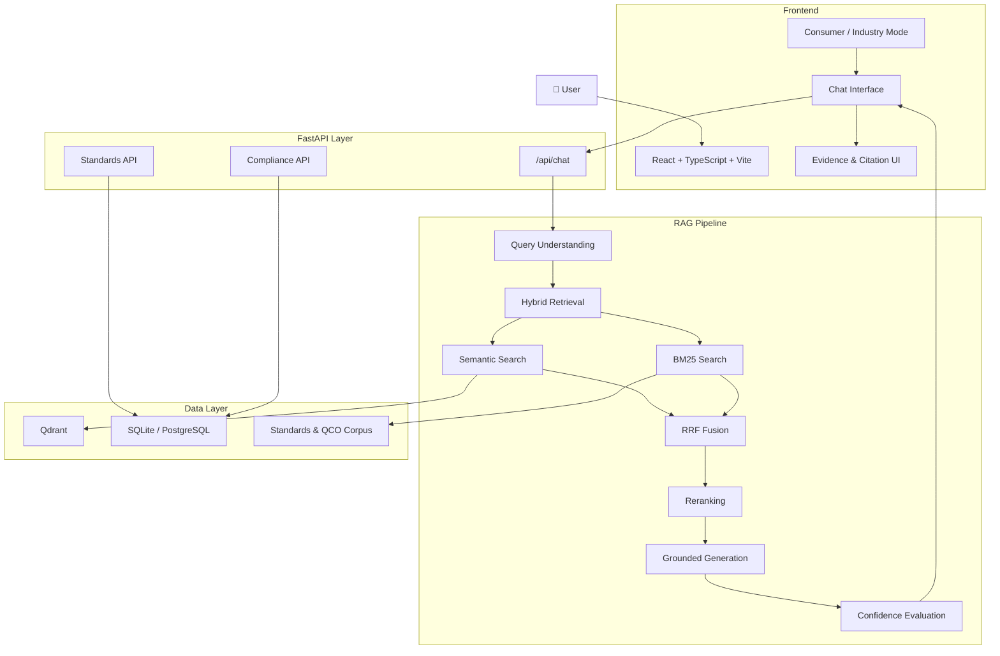

<div align="center">

# 🏛️ ManakSetu

### मानकसेतु

### AI-Powered Intelligence for Indian Standards & BIS Compliance

<p>
Ask questions about Indian Standards, BIS certification, QCOs, and compliance —
and get answers grounded in retrieved evidence rather than generic AI generation.
</p>

<p>
  <a href="https://manak-setu.vercel.app/">
    
  </a>
  <a href="https://github.com/lazy0ne369/ManakSetu">
    
  </a>
</p>

<p>
  
  
  
  
  
</p>

</div>

---

## 🔎 What is ManakSetu?

**ManakSetu (मानकसेतु)** is an AI-powered assistant designed to make Indian Standards and BIS-related information easier to understand, search, and verify.

Instead of treating the problem as a normal chatbot, ManakSetu explores a more important question:

> **How can an AI system answer technical and compliance-oriented questions while staying grounded in evidence and being honest about uncertainty?**

The system combines **query understanding, hybrid retrieval, reranking, compliance reasoning, evidence extraction, citation-aware generation, and automated evaluation** into a single pipeline.

### The core idea

```text
User Question
      ↓
Understand the Question
      ↓
Find Relevant Information
      ↓
Retrieve Supporting Evidence
      ↓
Generate Grounded Answer
      ↓
Show Where the Answer Came From
```

The objective is simple:

**Don't just generate an answer. Make the path to the answer inspectable.**

---

## 🌐 Live Demo

> **Try ManakSetu:**
> https://manak-setu.vercel.app/

The application is designed around two different audiences:

| Mode                 | Designed For                    | Focus                                                                 |
| -------------------- | ------------------------------- | --------------------------------------------------------------------- |
| 🛡️ **Consumer**     | Consumers & general users       | Simple explanations, product verification, BIS/ISI awareness          |
| ⚡ **Industry / Pro** | Manufacturers & technical users | Standards, clauses, certification and compliance-oriented information |

---

## ✨ What ManakSetu Can Do

### 🧠 Query Intelligence

The system does not blindly send every question into vector search.

It first considers:

* User intent
* Product/entity information
* Standard references
* Compliance terminology
* Ambiguity
* Whether clarification is required

For example:

> **"What is BIS certification?"**

and

> **"Which BIS standard applies to my electric water heater?"**

are treated as different types of questions and can follow different retrieval paths.

---

### 🔍 Hybrid Retrieval

ManakSetu combines **semantic retrieval** with **keyword retrieval**.

#### Semantic Search

Dense embeddings are used to retrieve conceptually relevant content from the vector database.

#### Keyword Search

BM25 helps preserve exact matches for information such as:

* Indian Standard numbers
* Clause references
* Product names
* Technical terminology
* Materials
* Regulatory terminology

The results are combined using **Reciprocal Rank Fusion (RRF)** and then reranked using additional relevance signals.

```text
                       User Query
                           │
                           ▼
                  Query Understanding
                           │
                 ┌─────────┴─────────┐
                 ▼                   ▼
          Semantic Search        BM25 Search
                 │                   │
                 └─────────┬─────────┘
                           ▼
                      RRF Fusion
                           │
                           ▼
                       Reranking
                           │
                           ▼
                  Relevant Evidence
```

---

### 👥 Persona-Adaptive Responses

The same technical information may need to be communicated differently depending on the user.

**Consumer Mode**

* Plain-language explanations
* Product/safety-oriented guidance
* BIS/ISI verification guidance
* Easier terminology

**Industry / Pro Mode**

* Technical requirements
* Clause-oriented information
* Certification workflows
* Compliance-oriented reasoning

---

### 📚 Evidence-First Answers

ManakSetu is designed around the principle that an answer should be traceable to supporting information.

The interface can expose evidence associated with retrieved information, including:

* Source document
* Relevant excerpt
* Page/section information
* Citation context
* Authoritative source references

This makes the system more useful for compliance-oriented questions than a conventional conversational chatbot.

---

### 🛡️ Clarification & Hallucination Resistance

When a question is too vague, the system can request additional information rather than making an unsupported assumption.

For example:

> **"What BIS certification do I need?"**

may require information about the specific product before a meaningful determination can be made.

The evaluation suite also includes cases involving:

* Non-existent standards
* Invalid clauses
* Out-of-domain questions
* Prompt-injection attempts

---

# 🏗️ System Architecture



---

# 🧩 Architecture Components

| Layer                  | Responsibility                                                      |
| ---------------------- | ------------------------------------------------------------------- |
| **React Frontend**     | User interaction, chat, persona selection and evidence presentation |
| **FastAPI**            | API gateway, validation and backend routing                         |
| **Query Intelligence** | Intent, entity and compliance-oriented query analysis               |
| **Semantic Retrieval** | Concept-based retrieval using embeddings                            |
| **BM25 Retrieval**     | Exact lexical retrieval                                             |
| **RRF**                | Combines multiple retrieval rankings                                |
| **Reranker**           | Applies additional relevance signals                                |
| **Grounded Generator** | Produces responses using retrieved context                          |
| **Confidence Layer**   | Evaluates answer support                                            |
| **Qdrant**             | Dense vector storage and retrieval                                  |
| **Relational DB**      | Structured standards/compliance data                                |
| **Evaluation Harness** | Automated quality and edge-case testing                             |

---

# 🧪 Evaluation

ManakSetu includes a **3-tier evaluation approach** covering different failure modes.

### Tier 1 — Factual & Retrieval Accuracy

Tests include:

* Clause lookups
* Standard matching
* QCO applicability
* Retrieval correctness

### Tier 2 — Persona & Compliance

Tests whether the system adapts appropriately between:

* Consumer-oriented responses
* Industry-oriented responses
* Compliance workflows

### Tier 3 — Edge Cases & Safety

Tests include:

* Non-existent IS numbers
* Invalid clauses
* Out-of-domain questions
* Prompt-injection probes
* Hallucination resistance

### Current Evaluation Snapshot

| Metric                   |             Result |
| ------------------------ | -----------------: |
| Test Suite               | **54 / 54 passed** |
| Pass Rate                |           **100%** |
| Hallucination Resistance |           **100%** |
| p50 Query Latency        |        **~506 ms** |
| p95 Query Latency        |        **~619 ms** |

> These figures represent the project's current evaluation snapshot and should be reproduced using the repository's evaluation tooling when benchmarking new changes.

---

# 🛠️ Technology Stack

### Frontend

* React
* TypeScript
* Vite
* Tailwind CSS
* Lucide React
* React Markdown
* Remark GFM
* Zod

### Backend

* Python 3.11+
* FastAPI
* Pydantic
* SQLAlchemy
* Alembic
* Uvicorn

### AI / RAG

* Sentence Transformers
* Qdrant
* BM25
* Reciprocal Rank Fusion
* Reranking
* Grounded LLM generation

### Data & Evaluation

* SQLite / PostgreSQL
* PyMuPDF
* Pytest
* Automated evaluation harness

---

# 📁 Project Structure

```text
ManakSetu/
│
├── backend/              # FastAPI backend & RAG pipeline
│
├── frontend/             # React + TypeScript frontend
│
├── docs/                 # Project documentation & evaluation material
│
├── tests/                # Automated tests
│
├── .env.example          # Environment configuration template
├── alembic.ini           # Database migration configuration
├── docker-compose.yml    # Container configuration
├── pytest.ini            # Pytest configuration
├── LICENSE
└── README.md
```

---

# 🚀 Getting Started

## Prerequisites

Make sure you have:

* **Python 3.11+**
* **Node.js 18+**
* **npm**
* Required environment variables configured from `.env.example`

---

## 1. Clone the repository

```bash
git clone https://github.com/lazy0ne369/ManakSetu.git
cd ManakSetu
```

---

## 2. Backend Setup

Create and activate a virtual environment:

### Windows

```bash
python -m venv venv
.\venv\Scripts\activate
```

Install dependencies:

```bash
pip install -r backend/requirements.txt
```

Run database migrations:

```bash
alembic upgrade head
```

Seed the knowledge base:

```bash
python -m backend.knowledge.seed_data
```

Start the API:

```bash
python -m uvicorn backend.main:app --host 127.0.0.1 --port 8000 --reload
```

Backend API:

```text
http://127.0.0.1:8000
```

Swagger documentation:

```text
http://127.0.0.1:8000/docs
```

---

## 3. Frontend Setup

Open a second terminal:

```bash
cd frontend
npm install
npm run dev
```

Frontend:

```text
http://127.0.0.1:5173
```

---

# 📡 API Overview

| Method | Endpoint                    | Purpose                          |
| ------ | --------------------------- | -------------------------------- |
| `POST` | `/api/chat`                 | Conversational RAG interaction   |
| `GET`  | `/api/standards/{id}`       | Retrieve standard information    |
| `GET`  | `/api/standards/search`     | Search standards                 |
| `GET`  | `/api/compliance/{product}` | Retrieve compliance information  |
| `GET`  | `/api/sources/`             | Retrieve verified source portals |
| `GET`  | `/api/history`              | Query/audit history              |
| `POST` | `/api/feedback`             | Submit user feedback             |
| `GET`  | `/api/health`               | Service health information       |

For the complete interactive API specification, run the backend and open:

```text
http://127.0.0.1:8000/docs
```

---

# 🔐 Responsible Use

ManakSetu is an **engineering and research project for navigating BIS-related information**.

It should not be treated as a substitute for:

* Official BIS decisions
* Legal advice
* Professional compliance consultation
* Certification authority decisions
* The latest applicable regulatory notifications

For compliance-critical decisions, users should verify the information against the relevant **official BIS and government sources**.

---

# 🗺️ Future Direction

Potential areas for further development include:

* Expanded standards and regulatory coverage
* More robust document ingestion
* Improved retrieval evaluation
* Better source freshness tracking
* More advanced compliance workflows
* Multilingual interaction
* Richer evidence visualization
* Production-grade observability
* More extensive automated benchmarking

---

# 👨‍💻 Author

**Sohan Kumar Sahu**

Lead Developer · AI / Software Engineering

GitHub: [@lazy0ne369](https://github.com/lazy0ne369)

---

# 📜 License

This project is licensed under the **MIT License**.

See [`LICENSE`](LICENSE) for details.

---

<div align="center">

### 🏛️ ManakSetu

**From questions to standards.
From standards to evidence.**

Built with curiosity, RAG, and a lot of engineering.

</div>
