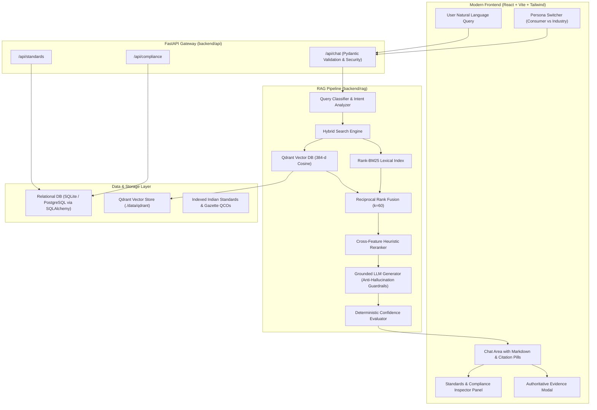

<div align="center">

# 🏛️ ManakSetu (मानकसेतु)

### AI-Powered Assistant for Indian Standards, BIS Services & Compliance

<p>
  <b>Helping users navigate Indian Standards, certification requirements, QCOs, and compliance information through evidence-grounded AI.</b>
</p>

<br/>

[](https://fastapi.tiangolo.com/)
[](https://react.dev/)
[](https://tailwindcss.com/)
[](https://qdrant.tech/)
[](https://www.python.org/)
[](docs/status/TIER_EVALUATION_REPORT.md)

<br/>

[Features](#-what-is-manaksetu) •
[Architecture](#-system-architecture) •
[Evaluation](#-evaluation) •
[Tech Stack](#️-technology-stack) •
[Setup](#-getting-started) •
[Roadmap](#-roadmap) •
[License](#-license--authorship)

</div>

---

## 📌 What is ManakSetu?

**ManakSetu (मानकसेतु)** is an experimental AI-powered assistant for navigating Indian Standards, BIS services, certification requirements, Quality Control Orders (QCOs), and related compliance information.

The project started from a problem statement around making BIS information easier to access, but evolved into a personal exploration of a broader engineering question:

> **How do you build a RAG system that can answer technical and compliance-oriented questions while remaining grounded in evidence and honest about uncertainty?**

Instead of treating the problem as a simple chatbot, ManakSetu combines:

- Query understanding
- Intent and entity extraction
- Hybrid retrieval
- Semantic + keyword search
- Reciprocal Rank Fusion (RRF)
- Reranking
- Compliance resolution
- Evidence extraction
- Citation-aware generation
- Schema validation
- Automated evaluation
- Clarification handling

The goal is not simply to generate an answer.

The goal is to make the path from:

**User Question → Relevant Information → Evidence → Answer**

as explicit and reliable as possible.

---

## 🎯 The Problem

Indian Standards and BIS-related information can be difficult to navigate because the information is distributed across technical standards, clauses, certification schemes, regulatory orders, and related documentation.

A user may know what they manufacture or want to purchase without knowing:

- Which Indian Standard applies
- Whether BIS certification is mandatory
- Whether a QCO applies
- Which certification scheme is relevant
- Which requirements actually matter
- Where a particular requirement appears in the source
- Whether additional information is required before making a determination

For example:

> "I manufacture stainless-steel pressure cookers for household use. What BIS requirements do I need to consider before selling them in India?"

This isn't simply a document search problem.

The system has to understand the product, determine what information is relevant, retrieve supporting evidence, and distinguish between what is known and what remains uncertain.

That is the problem ManakSetu is designed to explore.

---

# ✨ Core Features

## 1. 🧠 Query Intelligence

ManakSetu does not immediately send every question into vector search.

The query is first analyzed for:

- Intent
- Product/entity information
- Standard references
- Compliance-related terminology
- Ambiguity
- Required clarification

This allows the system to distinguish between questions such as:

> "What is BIS certification?"

and:

> "Which BIS standard applies to my electric water heater?"

These questions require different retrieval and reasoning paths.

---

## 2. 🔍 Hybrid Retrieval

The retrieval layer combines two complementary approaches:

### Semantic Retrieval
Uses dense embeddings and Qdrant to find conceptually relevant content.

### Keyword Retrieval
Uses BM25 to preserve exact matches for:
- Standard numbers
- Clause references
- Product terminology
- Technical terms
- Material names

The two result sets are combined using **Reciprocal Rank Fusion (RRF)**.

A heuristic reranking stage then considers additional signals such as exact standard references, product terms, materials, and clause identifiers.

Conceptually:

```text
                 User Query
                     │
                     ▼
             Query Understanding
                     │
              ┌──────┴──────┐
              ▼             ▼
        Semantic Search   BM25 Search
              │             │
              └──────┬──────┘
                     ▼
                 RRF Fusion
                     │
                     ▼
                 Reranking
                     │
                     ▼
              Relevant Evidence
```

---

## 3. 👥 Persona-Adaptive Reasoning Engine

- **🛡️ Consumer Mode**: Plain-language, safety-centric advice with step-by-step instructions on verifying the ISI Mark and CM/L license number via the **BIS CARE App**.
- **⚡ Industry / Pro Mode**: Technical clause thresholds (e.g. proof pressure, leakage current limits, spark test voltages), laboratory setup requirements, and Manakonline licensing steps.

---

## 4. 📜 Authoritative Evidence Drawer

Clicking any citation pill opens a modal with the **verbatim clause excerpt**, document page, section identifier, copy button, and direct link to the official **e-BIS portal**.

---

## 5. 🛡️ Clarification Engine & Zero Hallucination

- Underspecified queries (e.g. *"What BIS certification do I need?"*) trigger an interactive clarification card with clickable product chips.
- Non-existent standards (e.g. `IS 99999`) and fake clauses are **100% cleanly rejected**.

---

## 🏗️ System Architecture



---

## 🧪 Evaluation

ManakSetu includes a dedicated 3-tier automated evaluation benchmark covering:
- **Tier 1 (Factual & Retrieval Accuracy)**: Clause lookups, standard matching, QCO mandatory status.
- **Tier 2 (Persona Adaptation & Compliance)**: Consumer verification instructions vs manufacturer STI checklists.
- **Tier 3 (Edge Cases & Hallucination Resistance)**: Non-existent IS numbers, out-of-domain queries, and prompt injection probes.

| Metric | Result | Status |
| :--- | :--- | :--- |
| **Total Test Suite** | 54 / 54 Questions | **100.0% Pass Rate** |
| **Zero-Hallucination Resistance** | 100.0% | **Passed** |
| **Average Query Latency** | ~506ms (p50) / ~619ms (p95) | **Optimized** |

---

## 🛠️ Technology Stack

| Layer | Technologies |
| :--- | :--- |
| **Frontend** | React 18, TypeScript, Vite 6, Tailwind CSS 3.4, Lucide React, React Markdown, Remark GFM, Zod |
| **Backend** | FastAPI, Python 3.11+, Pydantic v2, SQLAlchemy ORM, Alembic, Uvicorn |
| **Databases** | PostgreSQL / SQLite (Relational), Qdrant (Persistent Dense Vector Store) |
| **RAG & Search** | PyMuPDF (PDF Parser), Sentence-Transformers, Rank-BM25, Reciprocal Rank Fusion (RRF) |
| **Evaluation** | Pytest, Custom 54-Question 3-Tier Automated Telemetry Harness |

---

## 🚀 Getting Started

### 1. Prerequisites
- **Python 3.11+**
- **Node.js 18+** & **npm**

### 2. Setup
```bash
# Clone the repository
git clone https://github.com/lazy0ne369/ManakSetu.git
cd ManakSetu

# Setup backend
python -m venv venv
.\venv\Scripts\activate
pip install -r backend/requirements.txt
alembic upgrade head
python -m backend.knowledge.seed_data

# Start backend server
python -m uvicorn backend.main:app --host 127.0.0.1 --port 8000 --reload
```

In a second terminal:
```bash
# Setup and start frontend
cd frontend
npm install
npm run dev
```
*Frontend runs at **http://127.0.0.1:5173/** (Backend Swagger at **http://127.0.0.1:8000/docs**)*.

---

## 📡 API Endpoints

| Method | Endpoint | Description |
| :--- | :--- | :--- |
| `POST` | `/api/chat` | Main conversational RAG endpoint (accepts query, user role, session ID) |
| `GET` | `/api/standards/{id}` | Retrieve complete standard details, clauses, and active amendments |
| `GET` | `/api/standards/search` | Full-text and metadata search for Indian Standards |
| `GET` | `/api/compliance/{product}` | Retrieve mandatory QCOs, certification schemes, and STI roadmap |
| `GET` | `/api/sources/` | List verified authoritative source portals (e-BIS, DPIIT, CRS) |
| `GET` | `/api/history` | Retrieve user query audit logs and execution telemetry |
| `POST` | `/api/feedback` | Submit thumbs-up/down ratings and user feedback |
| `GET` | `/api/health` | Service health status and LLM provider details |

---

## 📜 License & Authorship

This project is licensed under the **MIT License** — see the [LICENSE](file:///d:/BIS-IntelliAssist/LICENSE) file for details.

- **Author / Lead Developer**: **Sohan Kumar Sahu** ([@lazy0ne369](https://github.com/lazy0ne369))
- **Hackathon Track**: **Smart India Hackathon (SIH26107)**
- **Domain**: AI Compliance Assistant for the Bureau of Indian Standards (BIS)

All technical specifications and citations conform strictly to the published normative documents of the **Bureau of Indian Standards (BIS)** and the **Ministry of Consumer Affairs, Food & Public Distribution, Government of India**.
